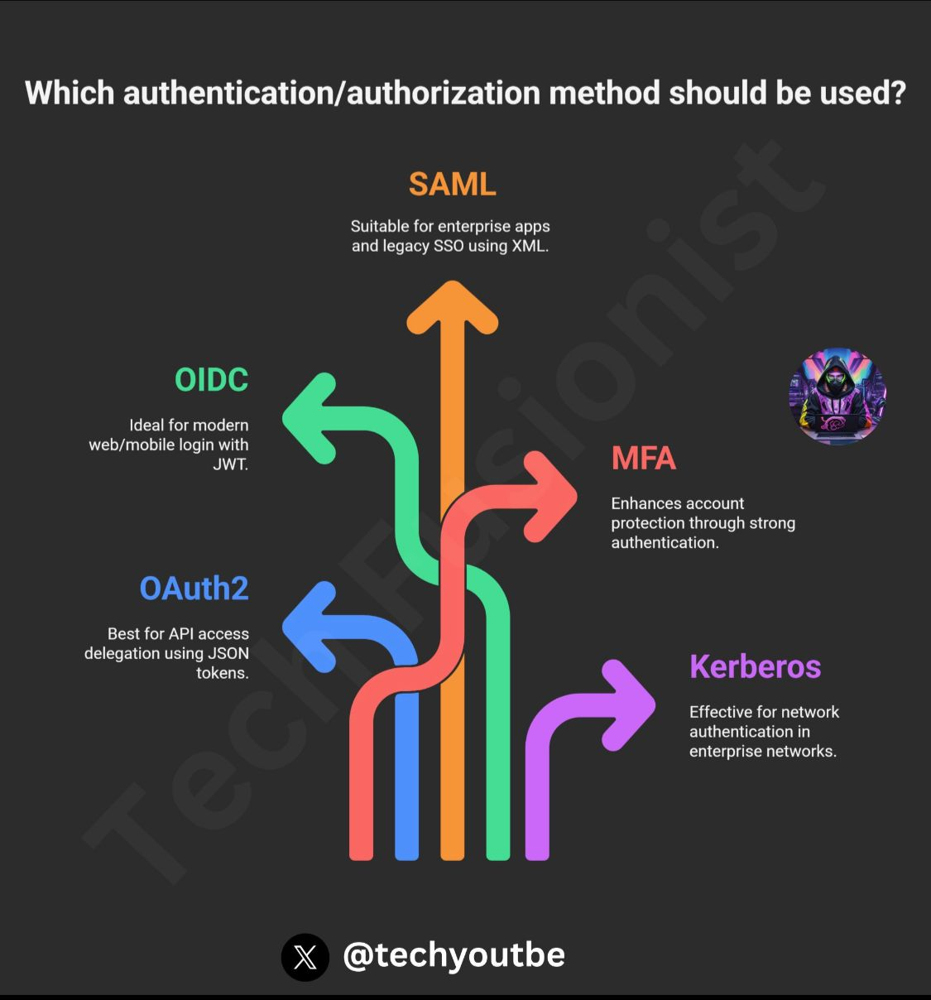

# Identity, Access and Secutiry

## Authentication/Authorization Mehtods

## Microsoft Entra ID
*formerly Azure Active Directory*

IAM - Idf=entity Access Management
Manages user identities, authentication, and authorization for accessing resources.

### Key Features
- Single Sign-On (SSO)
  - Allows users to access multiple applications with one set of credentials, improving user experience and reducing administrative overhead.
- Multi-Factor Authentication (MFA)
  - Enhances security by requiring additional verification (e.g., password + mobile code) to prevent unauthorized access.
- Conditional Access
  - Enables policies to control access based on conditions like user location, device type, or risk level.
- Role-Based Access Control (RBAC)
  - Assigns permissions based on roles to manage access to Azure resources securely.
- Identity Protection
  - Detects and mitigates identity-based risks, such as suspicious sign-ins or compromised credentials, with automated responses like password resets.
- B2B and B2C Collaboration
  - Supports secure access for external partners (B2B) and customers (B2C) through guest user invitations.
- Device Management
  - Enforces policies to ensure only compliant devices access resources.
- Application Management
  - Centralizes authentication for custom and third-party applications.

### Differences from Active Directory
Purpose: Entra ID is for cloud-based authentication, while ADDS is for on-premises environments.
Network: Entra ID operates over the internet, ADDS over an intranet.
Protocols: Entra ID uses SAML, OAuth, and OpenID; ADDS uses LDAP and Kerberos.
Microsoft Entra Domain Services: A PaaS version of ADDS for cloud-based domain controller capabilities without managing VMs.

## Azure Authentication Types
SSO - Single Sign-On
Passwordless (like Microsoft Authentication app or Windows Hello for Business)
MFA - Multi Factor Authentication
FIDO2 is the latest standard that incorporates the web authentication (WebAuthn) standard

Microsoft Entra External ID - For external resources and services
**Business to business (B2B) collaboration** - Collaborate with external users by letting them use their preferred identity to sign-in 
**B2B direct connect** - Establish a mutual, two-way trust with another Microsoft Entra organization for seamless collaboration 
**Microsoft Azure Active Directory business to customer (B2C)** - Publish modern SaaS apps or custom-developed apps (excluding Microsoft apps) to consumers and customers, while using Azure AD B2C for identity and access management.

## Conditional Access
- a user might not be challenged for second authentication factor if they're at a known location
- they might be challenged for a second authentication factor if their sign-in signals are unusual or they're at an unexpected location

## Azure RBAC - Role Based Access Control
*create a role and assign access to the role, then add users or resources to that role*
`if you hire a new engineer and add them to the Azure RBAC group for engineers, they automatically get the same access as the other engineers in the same Azure RBAC group`

Scopes:
- A management group (a collection of multiple subscriptions).
- A single subscription.
- A resource group.
- A single resource.

## Zero Trust model
- Verify explicitly 
  - Always authenticate and authorize based on all available data points.
- Use least privilege access 
  - Limit user access with Just-In-Time and Just-Enough-Access (JIT/JEA), risk-based adaptive policies, and data protection.
- Assume breach 
  - Minimize blast radius and segment access. Verify end-to-end encryption. Use analytics to get visibility, drive threat detection, and improve defenses.

## Defense In-Depth
- The physical security layer is the first line of defense to protect computing hardware in the datacenter.
- The identity and access layer controls access to infrastructure and change control.
- The perimeter layer uses distributed denial of service (DDoS) protection to filter large-scale attacks before they can cause a denial of service for users.
- The network layer limits communication between resources through segmentation and access controls.
- The compute layer secures access to virtual machines.
- The application layer helps ensure that applications are secure and free of security vulnerabilities.
- The data layer controls access to business and customer data that you need to protect.
