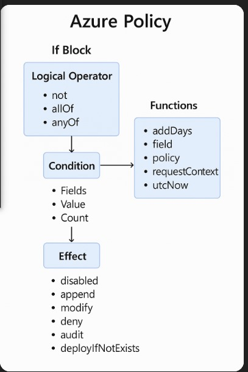

# Azure Policy initiatives

**Azure main governance tool = Azure Policy**

Azure Policy is a service that allows you to create, assign, and manage governance policies that enforce rules and effects over Azure resources to ensure that they stay compliant with your IT governance standards.
These policies enforce various rules and effects on resources, ensuring that they adhere to corporate standards and service-level agreements.

**Will learn to**
- Assign a policy to enforce a condition for resources you create in the future
- Create and assign an initiative definition to track compliance for multiple resources
- Resolve a noncompliant or denied resource
- Implement a new policy across an organization

---

**Cloud Adoption Framework for Azure** - offers comprehensive technical guidance for Microsoft Azure. 
**Cloud governance** refers to the **management of cloud usage in your organization**. 

Cloud Adoption Framework - **Govern methodology** 
- offers a systematic **framework for setting up and improving cloud governance in Azure**. 
- addresses crucial areas, such as regulatory compliance, security, operations, cost management, data, resource management, and AI
- essential for defining and maintaining efficient cloud use
- divides cloud governance into five steps

1. Build a governance team 
2. Assess cloud risks
3. Document cloud governance policies
4. Enforce cloud governance policies
5. Monitor cloud governance

Key considerations when defining a corporate cloud governance policy
- Business risk – You must document the evolving business risks and the business's tolerance for risk based on data classification and application criticality.
- Policy and compliance – You must convert risk decisions into policy statements to establish cloud adoption boundaries efficiently.
- Process – You must establish processes to monitor violations and adherence to corporate policies.

Five core disciplines of cloud governance
1. Cost management
2. Secutiry Guidelines - Ensures compliance with IT security requirements by applying a security baseline to all adoption efforts.
3. Resource consistency - Ensures consistency in resource configuration and enforcing practices for onboarding, recovery, and discoverability.
4. Identity baseline - Ensures that the baseline for identity and access is enforced by consistently applying role definitions and assignments.
5. Deployment acceleration

Levels of management to establish proper governance
- Management groups - **Azure management groups provide a level of scope above subscriptions. If you have many subscriptions, you might need a way to efficiently manage access, policies, and compliance for those subscriptions**
- Subscriptions - unit of management, billing, and scale
- Resource groups - groupings of resources
- Resources - basic building block of Azure

---

## Azure Resource Manager
Azure Resource Manager is the deployment and management service for Azure. It provides a management layer that allows you to create, update, and delete resources in your Azure account.

Azure operations are classified into two main types: 
- control plane - helps you manage resources in your subscription
- data plane - allows you to access the capabilities provided by instances of specific resource types

### Control Plane
- **Azure Policy operates in the control plane** to **enforce rules and compliance on your resources** 
- **Azure Resource Manager manages all control plane operations** in Azure and includes the different components that are centralized between the different services. 
- **Azure Policy is integrated with Azure Resource Manager**

Functions
- template-based deployments
- role-based access control (RBAC)
- auditing
- monitoring
- tagging - unified management experience for Azure resources after deployment

*You send requests to Control plane through any of the Azure APIs, tools, or SDKs and Azure Resource Manager receives the request*

### Data Plane
- where the actual data operations occur, and Azure Policy ensures that the resources you interact with in the data plane are compliant with your policies
- operations involve direct interaction with the data stored in a resource
- each Azure service handles these requests internally, bypassing Azure Resource Manager, and directly managing the data through its resource provider
- Service-specific access controls, such as RBAC or access control lists (ACLs), often manage data plane permissions
- The service responds with the data or result of the data operation, ensuring that the requester has the correct permissions

---

## Azure Policy resources
- Azure Policy enforces organizational standards and assesses compliance at scale
- evaluates Azure resources and actions by comparing their properties to business rules
- allows for detailed analysis down to each resource and policy level with granularity

Six policy resources are available in Azure
1. Definitions - describe resource compliance conditions and the effect to take if a condition is met under a scope (any scope: RG, MG, resources, subscriptions)
2. Initiatives - also known as a policy set, allow you to group several policy definitions to simplify assignments and management because you work with the initiatives as a single item
    - multiple tagging policy definitions can be grouped into a single initiative and this initiative can be applied in a resource instead of applying each policy individually
3. Assignments - define which resources are evaluated by a policy definition or initiative
4. Exemptions - feature to exempt a resource hierarchy or an individual resource from evaluation of initiatives or definitions
5. Attestations - set compliance states of resources or scopes targeted by manual policies
    - Each applicable resource requires one attestation for each manual policy assignment
    - manual policies should be designed to target the scope that defines the boundary of resources whose compliance state needs to be attested
6. Remediations - bring resources into compliance based on a definition and assignment
    - Resources that are noncompliant to a modify or deployIfNotExists definition assignment can be brought into compliance by using a remediation task

---

## Azure Policy definitions
**describes resource compliance conditions and the action or effects that take place if those conditions are met**

Policy has two parts
- A condition that compares a resource property field or a value to a required value
- The effect determines what happens when the policy rule is evaluated to match the condition




### Policy Design
```json
{
  "displayName": "Allowed locations",
  "description": "This policy enables you to restrict the locations your organization can specify when deploying resources. Use to enforce your geo-compliance requirements. Excludes resource groups, Microsoft.AzureActiveDirectory/b2cDirectories, and resources that use the 'global' region.",
  "policyType": "BuiltIn",
  "mode": "Indexed",
  "metadata": {
    "version": "1.0.0",
    "category": "General"
  },
  "parameters": {
    "listOfAllowedLocations": {
      "type": "Array",
      "metadata": {
        "description": "The list of locations that can be specified when deploying resources.",
        "strongType": "location",
        "displayName": "Allowed locations"
      }
    }
  },
    "policyRule": {
      "if": {
        "allOf": [
          {
            "field": "location",
            "notIn": "[parameters('listOfAllowedLocations')]"
          },
          {
            "field": "location",
            "notEquals": "global"
          },
          {
            "field": "type",
            "notEquals": "Microsoft.AzureActiveDirectory/b2cDirectories"
          }
        ]
      },
      "then": {
        "effect": "deny"
      }
    }
  }
```

**Logical operators and conditions (if blocks)**
```json
{
  "if": {
    "allOf": [
      {
        "field": "location",
        "notIn": "[parameters('listOfAllowedLocations')]"
      },
      {
        "field": "location",
        "notEquals": "global"
      },
      {
        "field": "type",
        "notEquals": "Microsoft.AzureActiveDirectory/b2cDirectories"
      }
    ]
  },
  "then": {
    "effect": "deny"
  }
}
```

**Nested Logical operators and conditions (if blocks)**
```json
"if": {
    "allOf": [
      {
        "not": {
          "field": "tags",
          "containsKey": "application"
        }
      },
      {
        "field": "type",
        "equals": "Microsoft.Storage/storageAccounts"
      }
    ]
  },
```

**Conditions**
```json
{
  "if": {
    "allOf": [
      {
        "value": "[resourceGroup().name]",
        "like": "*netrq"
      },
      {
        "field": "type",
        "notLike": "Network/*"
      }
    ]
  },
  "then": {
    "effect": "deny",
    "details": {
      "count": {
        "field": "Microsoft.Network/virtualNetworks/addressSpace.addressPrefixes[*]",
        "where": {
          "value": "[ipRangeContains('10.0.0.0/24', current('Microsoft.Network/virtualNetworks/addressSpace.addressPrefixes[*]'))]",
          "equals": "greater"
        }
      }
    }
  }
}
```

**Functions**
| Function | Description |
|----------|-------------|
| `addDays(dateTime, numberOfDaysToAdd)` | `dateTime`: [Required] string - String in the Universal ISO 8601 DateTime format 'yyyy-MM-ddTHH:mm:ss.FFFFFFFZ'.<br>`numberOfDaysToAdd`: [Required] integer - Number of days to add. |
| `Field(fieldName)` | `fieldName`: [Required] string - Name of the field to retrieve.<br>Returns the value of that field from the resource evaluated by the If condition.<br>`field` is primarily used with `auditIfNotExists` and `deployIfNotExists` to reference fields on the resource that are being evaluated. |
| `requestContext().apiVersion` | Returns the API version of the request that triggered policy evaluation. This value is the API version that was used in the PUT/PATCH request for evaluations on resource creation/update. The latest API version is always used during compliance evaluation on existing resources. |
| `policy()` | Returns the following information about the policy that's being evaluated. Properties can be accessed from the returned object.<br>`"assignmentId": "",`<br>`"definitionId": "",`<br>`"setDefinitionId": "",`<br>`"definitionReferenceId": ""` |
| `ipRangeContains(range, targetRange)` | `range`: [Required] string - String specifying a range of IP addresses to check if the `targetRange` is within range.<br>`targetRange`: [Required] string - String specifying a range of IP addresses to validate as included within the range.<br>Returns a boolean for whether the range IP address range contains the `targetRange` IP address range. Empty ranges or mixing between IP families isn't allowed and results in evaluation failure. |
| `current(indexName)` | Special function that can only be used inside count expressions. |

**Effect types (then blocks)**
- The second part of the policyRule in an Azure Policy definition is the then block. 
- This block defines the effect that takes place when the policy rule is evaluated to match the condition resources. 
- More than one effect can be valid for a given policy definition. 
- Parameters are often used to specify allowed effect values (allowedValues) in such cases so that a single definition can be more versatile during assignment. 
- Resource properties and logic in the policy rule can determine whether a certain effect is considered valid to the policy definition.

## Evaluation of resources through Azure Policy
- Learn about evaluation triggers, timings, and the resource compliance states
- Can be used to prevent resources from being created in the wrong location, enforce common and consistent tag usage, or audit existing resources for appropriate configurations and settings

### Evaluation Triggers
Evaluations of assigned policies and initiatives happen as the result of various events:

- A policy or initiative is newly assigned to a scope
- A policy or initiative already assigned to a scope is updated
- A resource is deployed to or updated in a scope with an assignment through Azure Resource Manager, REST API, or a supported SDK
- A subscription (resource type Microsoft.Resources/subscriptions) is created or moved in a management group hierarchy with an assigned policy definition that targets the subscription resource type
- A policy exemption is created, updated, or deleted
- Standard compliance evaluation cycle
- The machine configuration resource provider is updated with compliance details by a managed resource
- On-demand scan

More on [Evaluation Triggers](https://learn.microsoft.com/en-us/training/modules/sovereignty-policy-initiatives/azure-policies-evaluation-resources#:~:text=more%20information%2C%20see-,Evaluation%20triggers,-.)

### Evaluation Timming
Compliance scans through Azure policies are triggered by various methods

- When you assign a new policy, a delay can occur in the policy taking effect, which can be up to 30 minutes.
  - To bypass the caching delay, you can sign out and sign back in to refresh the Azure Resource Manager cache, which ensures that the new policy is applied immediately to the defined scope.

After the scan starts, several factors influence how long it takes for a compliance scan to complete:
- Policy definitions - The size and complexity of the policy definitions
- Number of policies
- Scope size
- System load - Compliance scans are a low-priority operation, meaning that if the system is busy with more critical tasks, the scan might take longer. The system prioritizes interactive and high-importance operations, so scans might take several minutes, or tens of minutes, even in smaller environments.
- Synchronous scan (Low-Priority Execution) - Because compliance scans are synchronous and assigned a low priority in Azure's system, they're delayed if the system is busy. This scan can significantly extend the time it takes for the scan to complete, even for smaller scopes or policies.

### Resource compliance states 
Evaluation provides one of the compliance states to each resource based on conditions in the policy rule and each resource's adherence to those requirements.

Compliance States:
- Non-compliant
- Compliant
- Error (for template or evaluation error)
- Conflicting (two or more policy assignments in the same scope with contradicting rules, such as two policies appending the same tag with different values)
- Protected (resource covered under an assignment with a denyAction effect)
- Exempted Unknown (default state for definitions with a manual effect)

More on [Compliance States](https://learn.microsoft.com/en-us/azure/governance/policy/concepts/compliance-states)

### Enforcement Mode
`enforcementMode` is a property of a policy assignment that lets you deactivate the enforcement of certain policy effects  
**`enforcementMode` is different from the `disabled effect`. The `disabled effect` prevents resource evaluation from happening at all while `enforcementMode` lets the evaluation happen without the effect taking place.**

When enabled: The policy effect is enforced during resource creation or update  
When disabled: The policy effect isn't enforced during resource creation or update

### Safe deployment best practices framework for Azure Policy assignments

The following steps correspond with the outlined steps in the preceding screenshot:

1. Create definition - Begin by defining the policy definition with the scope as root (tenant).
2. Create assignment - Define deployment rings (1 to 5) by using resource selectors. Assign the policy to a specific scope (such as a resource group, subscription, or management group) in Ring 5. Assign with enforcementMode Disabled to evaluate compliance without enforcing changes.
3. 
  - Compliance check - Verify that the policy is being applied correctly and that the desired compliance state is achieved for the resources in Ring 5
  -  Application health check - Assess the impact of the policy for the resources in Ring 5. Ensure that no unexpected side effects exist.
4. Repeat for each ring (Non-production) - Repeat step 3 for all nonproduction environment rings.
5. Update assignment (Optional) - If necessary, adjust the policy definition or assignment based on the evaluation of resources of the nonproduction environment and then reassign it to the resources in Ring 5 with the enforcementMode Enabled.
6. 
    - Compliance check - Reevaluate compliance after making changes (same as step 3a).
    - Application health check - Again, verify that the policy isn't causing issues (same as step 3b).
7. Repeat for each ring (Non-production) - Repeat step 6 for all nonproduction environment rings.
8. Repeat for production rings - After the policy is validated in a nonproduction environment, gradually deploy it to production environments, starting with a smaller subset (ring) and expanding the scope over time.

More on [Safe deployment of Azure Policy assignments](https://learn.microsoft.com/en-us/azure/governance/policy/how-to/policy-safe-deployment-practices#steps-for-safe-deployment-of-azure-policy-assignments-with-deny-or-append-effects)